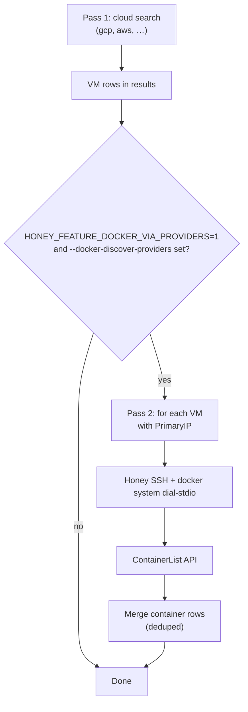

Honey can run a **second search pass** after GCP, AWS, or other VM discovery: for each matching VM it SSHes to the host, dials `docker.sock`, and lists **running containers** as separate table rows (`provider: docker`). You can then open a **`docker exec`** shell from the TUI or [Web UI](./web-ui.md) without configuring a static `backends.docker` entry per VM.

Auto-discover is **experimental** and gated by an environment variable. It is **not** available in honey YAML today—only CLI flags (and the same fields on `honey search` / MCP when exposed).

## How it works



1. **Pass 1** runs your normal providers (`--provider`, `--backends`, name filters, cache).
2. **Pass 2** keeps only VM records whose `provider` is listed in `--docker-discover-providers` (for example `gcp`, `aws`).
3. For each VM with a **PrimaryIP**, honey opens **Honey SSH** (same stack as `via_ssh` docker backends), optionally **`sudo -n -u`** a user that can use the socket, then calls the Engine API.
4. Container rows are **merged** into the result set (VM rows stay; containers are additional rows).

Discover respects filters from pass 1: if you use `--backends gcp-stg2`, only VMs from that backend are scanned. If you use a positional name or `--name`, only VMs that matched that filter are candidates.

## Prerequisites

| Requirement | Notes |
|-------------|--------|
| **Feature flag** | `export HONEY_FEATURE_DOCKER_VIA_PROVIDERS=1` (exactly `1`; unset = discover disabled) |
| **Cloud credentials** | Same as a normal `honey search` for GCP/AWS (ADC, profiles, etc.) |
| **SSH access** | Your `--ssh-user` (or `defaults.ssh_user`) must reach each VM’s **PrimaryIP** |
| **Docker on the VM** | Engine listening on the socket you target (default Linux: `/var/run/docker.sock`) |
| **Socket permissions** | SSH user in the `docker` group **or** passwordless `sudo` for `--docker-discover-run-as` (see below) |

`--provider` must include every cloud id you pass to `--docker-discover-providers`. Example: discover `gcp` but `--provider aws` only → honey logs a warning and **skips** discover.

## Quick start

```bash
# 1. Enable the feature (required every shell session unless you export in profile)
export HONEY_FEATURE_DOCKER_VIA_PROVIDERS=1

# 2. Search GCP + AWS VMs, then list containers on those VMs
honey search --provider gcp,aws \
  --docker-discover-providers gcp,aws \
  my-app
```

Interactive TUI (default): pick a **docker** row and press **Enter** for `docker exec`, or use parallel **e** on marked containers.

JSON for scripting:

```bash
export HONEY_FEATURE_DOCKER_VIA_PROVIDERS=1
honey search --provider gcp,aws \
  --docker-discover-providers gcp,aws \
  --json my-app
```

## Common recipes

### Limit to one config backend

```bash
export HONEY_FEATURE_DOCKER_VIA_PROVIDERS=1
honey search --config ~/.config/honey/config.yaml \
  --backends gcp-stg2 \
  --docker-discover-providers gcp \
  --ssh-user ubuntu \
  api
```

Only VMs from the `gcp-stg2` backend are scanned; other GCP projects in the file are ignored.

### SSH as `ubuntu`, Docker socket only for `root`

Many images allow SSH as a normal user but restrict `/var/run/docker.sock` to root:

```bash
export HONEY_FEATURE_DOCKER_VIA_PROVIDERS=1
honey search --provider gcp,aws \
  --docker-discover-providers gcp,aws \
  --ssh-user ubuntu \
  --docker-discover-run-as root \
  web
```

Honey runs `sudo -n -u root` and `docker system dial-stdio` (Engine **23+**). Password prompts are not supported—configure **passwordless sudo** for that user pair.

### Custom socket or Windows VM

```bash
export HONEY_FEATURE_DOCKER_VIA_PROVIDERS=1
honey search --provider gcp \
  --docker-discover-providers gcp \
  --docker-socket /var/run/docker.sock \
  --docker-platform linux \
  win-worker
```

For a Windows daemon host, set `--docker-platform windows` and a TCP socket if needed (for example `tcp://127.0.0.1:2375`).

### Include stopped containers

Discover honors `--docker-all` (same as static docker search):

```bash
export HONEY_FEATURE_DOCKER_VIA_PROVIDERS=1
honey search --provider aws \
  --docker-discover-providers aws \
  --docker-all \
  legacy-svc
```

## Flags reference

| Flag | Purpose |
|------|---------|
| `HONEY_FEATURE_DOCKER_VIA_PROVIDERS=1` | **Required** env var to enable pass 2 |
| `--docker-discover-providers` | Comma-separated VM providers to scan (`gcp`, `aws`, …) |
| `--provider` | Must include those cloud providers in pass 1 |
| `--backends` | Optional; limits which named YAML backends run in pass 1 (and thus which VMs get discover) |
| `--ssh-user` | SSH user for Honey dial to each VM (wired as `DockerSSHUser`) |
| `--docker-discover-run-as` | User for `sudo -n -u …` when the SSH user cannot use `docker.sock` |
| `--docker-socket` | Remote socket path (default: `/var/run/docker.sock` on Linux) |
| `--docker-platform` | `linux` or `windows` (daemon host OS) |
| `--docker-all` | Include non-running containers |
| `--docker-mode` | `containers` (default), `swarm`, or `both` for discover listing |

Positional `[name]`, `--name`, and `--name-regex` apply to **both** passes (VM names and container names).

CLI details: [`honey search`](./cli/honey_search.md).

## Result rows

Discovered containers have `provider: docker` and `meta.docker_discover: "1"`. Useful `meta` keys:

| Key | Meaning |
|-----|---------|
| `container_id` | Required for terminal / exec |
| `docker_vm` | Source VM name |
| `docker_vm_ip` | Internal IP used for SSH to the daemon |
| `docker_vm_external_ip` | Public IP when the cloud row had one |
| `docker_transport` | `honey_ssh` |
| `via_provider` | `gcp`, `aws`, … |

The table **IP** column may show the VM’s **external** address; honey still dials **`docker_vm_ip`** for the Engine API.

## Troubleshooting

| Symptom | What to check |
|---------|----------------|
| No container rows, only VMs | `HONEY_FEATURE_DOCKER_VIA_PROVIDERS=1` exported? `--docker-discover-providers` set? |
| Warning about providers | Add discover providers to `--provider` (e.g. `--provider gcp,aws` with `--docker-discover-providers gcp,aws`) |
| Discover skipped per VM | VM has no `PrimaryIP`; SSH failed; or docker/API error (see debug log with `--debug-log`) |
| `permission denied` on socket | Add user to `docker` group or use `--docker-discover-run-as root` with passwordless sudo |
| Feature flag set but still nothing | VMs from pass 1 must match `--docker-discover-providers` ids exactly (`gcp`, not `gcp-team-a`) |

## Related docs

- [Web UI](./web-ui.md) — browser terminal and exec on discovered container rows
- [CUE recipes](./cue-recipes.md) — match container **names** in recipe `host` fields
- [Add a new backend](./add-new-backend.md) — contributor guide (static `backends.docker` vs discover hook)

For local or config-file Docker backends (no cloud pass), use `honey search --provider docker` and YAML `backends.docker` as described in the [GitHub README](https://github.com/shareed2k/honey#docker-provider).
