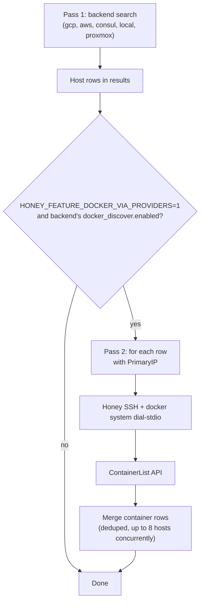

Honey can run a **second search pass** after GCP, AWS, Consul, Local, or Proxmox discovery: for each matching VM/host it SSHes to the host, dials `docker.sock`, and lists **running containers** as separate table rows (`provider: docker`). You can then open a **`docker exec`** shell from the TUI or [Web UI](./web-ui.md) without configuring a static `backends.docker` entry per VM.

Auto-discover is **experimental**, gated by an environment variable, and configured **only in YAML** — there are no dedicated CLI flags for it (no `--docker-discover-providers`/`--docker-discover-run-as`; those do not exist).

## How it works



1. **Pass 1** runs whichever backends are enabled normally (`--provider`, `--backends`, name filters, cache) — this feature currently wraps the **`gcp`, `aws`, `consul`, `local`, and `proxmox`** backend factories (not `k8s`, `truenas`, or `docker` itself).
2. **Pass 2** runs only for backends whose merged **`docker_discover.enabled`** is `true` (see YAML below) — there's no separate provider allowlist to configure; every host row from an enabled backend is a candidate.
3. For each candidate row with a **PrimaryIP**, honey opens **Honey SSH** (same stack as `via_ssh` docker backends), optionally **`sudo -n -u`** a user that can use the socket, then calls the Engine API. Up to **8 hosts** are probed concurrently.
4. Container rows are **merged** into the result set (host rows stay; containers are additional rows).

Discover respects pass-1 filters: if you use `--backends gcp-stg2`, only hosts from that backend are scanned. If you use a positional name or `--name`, only hosts that matched that filter are candidates.

## Prerequisites

| Requirement | Notes |
|-------------|--------|
| **Feature flag** | `export HONEY_FEATURE_DOCKER_VIA_PROVIDERS=1` (exactly `1`; unset = discover disabled, even with `docker_discover.enabled: true` in YAML) |
| **Backend credentials** | Same as a normal `honey search` for that backend (ADC, profiles, Consul token, etc.) |
| **SSH access** | Honey must be able to reach each host's **PrimaryIP** over SSH. For `local`/`proxmox` backends, a per-host/per-backend **`ssh_user`** field is honored; **GCP and AWS have no `ssh_user` config today** — the discover SSH hop uses whatever your SSH client/agent defaults to for that host, which may need `~/.ssh/config` entries per host |
| **Docker on the host** | Engine listening on the socket you target (default Linux: `/var/run/docker.sock`) |
| **Socket permissions** | SSH user in the `docker` group **or** passwordless `sudo` for `docker_discover.run_as` (see below) |

## Quick start

Enable the feature flag, then turn on discover for a backend in your config file:

```bash
export HONEY_FEATURE_DOCKER_VIA_PROVIDERS=1
```

```yaml
# ~/.config/honey/config.yaml
version: 1
backends:
  gcp:
    - name: my-gcp
      project: my-gcp-project
      docker_discover:
        enabled: true
```

```bash
honey search --config ~/.config/honey/config.yaml --provider gcp my-app
```

Interactive TUI (default): pick a **docker** row and press **Enter** for `docker exec`, or use parallel **e** on marked containers.

JSON for scripting: add `--json` / `-o json` to the same command.

## Common recipes

### Enable for every backend at once

Set `docker_discover` under top-level **`defaults`** instead of repeating it per backend — every backend that supports discover (`gcp`, `aws`, `consul`, `local`, `proxmox`) picks it up unless it sets its own `docker_discover` block (per-field override, not whole-block replace):

```yaml
defaults:
  docker_discover:
    enabled: true
backends:
  gcp:
    - name: my-gcp
      project: my-gcp-project
  aws:
    - name: my-aws
      profile: production
      docker_discover:
        enabled: false   # opt this one backend out
```

### SSH as a user that needs `sudo` for the socket

Many images allow SSH as a normal user but restrict `/var/run/docker.sock` to root:

```yaml
backends:
  local:
    - name: lab
      hosts:
        - name: web1
          primary_ip: 10.0.0.10
          ssh_user: ubuntu
      docker_discover:
        enabled: true
        run_as: root
```

Honey runs `sudo -n -u root` and `docker system dial-stdio` (Engine **23+**). Password prompts are not supported — configure **passwordless sudo** for that user pair.

### Custom socket or Windows host

```yaml
backends:
  gcp:
    - name: my-gcp
      project: my-gcp-project
      docker_discover:
        enabled: true
        socket: /var/run/docker.sock
        platform: linux   # or "windows"
```

For a Windows daemon host, set `platform: windows`.

### Stopped containers, swarm mode, `--docker-all` / `--docker-mode`

The discover pass always lists **running containers only** (`mode: containers`) — the `--docker-all` and `--docker-mode` flags apply to static `backends.docker` search, not to this auto-discover pass, and there is currently no `docker_discover` field to change that.

## `docker_discover` fields

| Field | Default | Meaning |
|-------|---------|---------|
| `enabled` | `false` | Turn discover on for this backend (or under `defaults` for all supporting backends) |
| `run_as` | _(SSH user)_ | `sudo -n -u <run_as>` before calling the Engine API, when the SSH user can't use the socket directly |
| `socket` | `/var/run/docker.sock` | Remote Engine socket path |
| `platform` | `linux` | `linux` or `windows` |

Backend-level fields override `defaults` **per field** (`enabled`/`run_as`/`socket`/`platform` each override independently, not as a whole block).

Positional `[name]`, `--name`, and `--name-regex` apply to **both** passes (host names and container names).

CLI details: [`honey search`](./cli/honey_search.md).

## Result rows

Discovered containers have `provider: docker` and `meta.docker_discover: "1"`. Useful `meta` keys:

| Key | Meaning |
|-----|---------|
| `container_id` | Required for terminal / exec |
| `docker_vm` | Source VM name |
| `docker_vm_ip` | Internal IP used for SSH to the daemon |
| `docker_vm_external_ip` | Public IP when the cloud row had one |
| `docker_transport` | `honey_ssh` |
| `via_provider` | `gcp`, `aws`, … |

The table **IP** column may show the VM’s **external** address; honey still dials **`docker_vm_ip`** for the Engine API.

## Troubleshooting

| Symptom | What to check |
|---------|----------------|
| No container rows, only VMs | `HONEY_FEATURE_DOCKER_VIA_PROVIDERS=1` exported? `--docker-discover-providers` set? |
| Warning about providers | Add discover providers to `--provider` (e.g. `--provider gcp,aws` with `--docker-discover-providers gcp,aws`) |
| Discover skipped per VM | VM has no `PrimaryIP`; SSH failed; or docker/API error (see debug log with `--debug-log`) |
| `permission denied` on socket | Add user to `docker` group or use `--docker-discover-run-as root` with passwordless sudo |
| Feature flag set but still nothing | VMs from pass 1 must match `--docker-discover-providers` ids exactly (`gcp`, not `gcp-team-a`) |

## Related docs

- [Web UI](./web-ui.md) — browser terminal and exec on discovered container rows
- [CUE recipes](./cue-recipes.md) — match container **names** in recipe `host` fields
- [Add a new backend](./add-new-backend.md) — contributor guide (static `backends.docker` vs discover hook)

For local or config-file Docker backends (no cloud pass), use `honey search --provider docker` and YAML `backends.docker` as described in the [GitHub README](https://github.com/shareed2k/honey#docker-provider).
